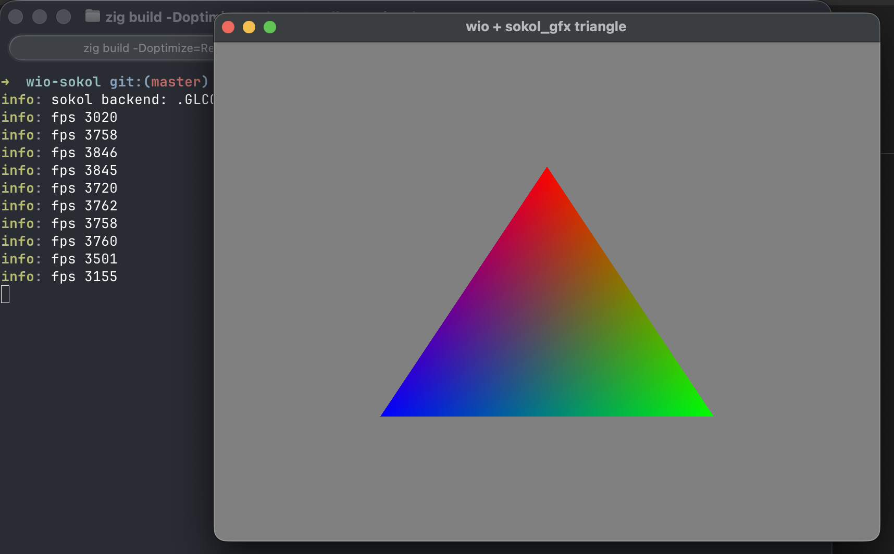

# wio-sokol integration examples

This is a small repo showing off how to integrate [sokol-zig](https://github.com/floooh/sokol-zig) with [wio](https://github.com/ypsvlq/wio). Both are absolutely fantastic!

⚠️ Warning: only tested and working on macOS for now. Linux coming soon.

**But sokol_app exists?! why wio?**
- wio is pure zig (zig + system libs of course)
- wio allows to control vsync: turning vsync off, and choosing your exact target FPS in your main loop, is possible and entirely up to you

Still sokol_gfx is one of the best lean, modern GPU abstraction. It fits in the right place, supports multiple backends, and is very small (code/binary size) compated to WebGPU implementations.

In this repo we focus for now on the SOKOL_GLCORE backend, because it is the easiest to integrate.

## Build

```sh
zig build -Doptimize=ReleaseSmall examples
```

## Run one example:

```sh
zig build -Doptimize=ReleaseSmall run-triangle
```

```sh
zig build --fork=/home/michael/dev/zig/wio-extra run-triangle
(zig build --fork=/Users/mpalomas/dev/zig/wio-extra run-triangle)
info: fork /home/michael/dev/zig/wio-extra matched 1 wio_extra packages
info: display 0: 1512x982 at (0,0) scale 2.00 -> 3024x1964 pixels @ 120.0006Hz (24000000/199999)
info: desired framebuffer 1280x720 at scale 2.0000 -> createWindow size 640x360
info: window display: 1512x982 at (0,0) scale 2.00 -> 3024x1964 pixels @ 120.0006Hz (24000000/199999)
info: sokol backend: .GLCORE
info: framebuffer_size 1280x720
info: fps 3414
```


